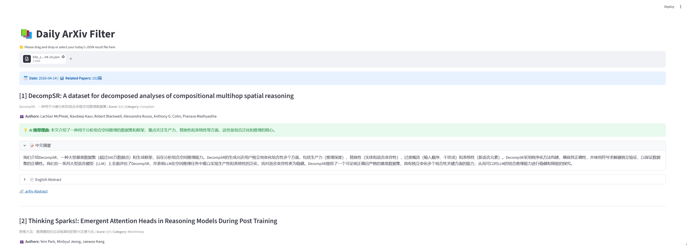
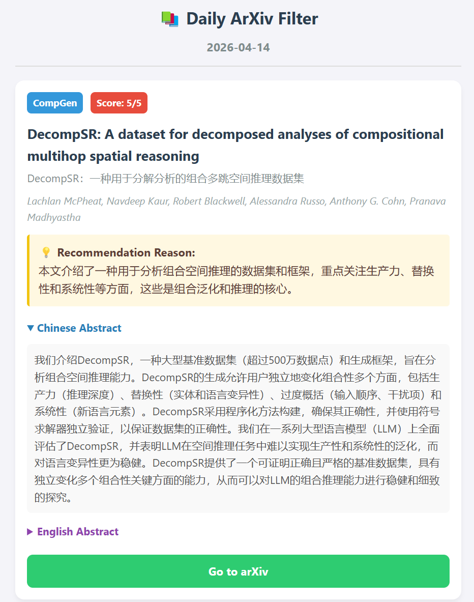

# 📚LLM-Paper-Filter

An automated, LLM-driven pipeline designed to sift through the daily avalanche of AI research papers. 

Currently, this repository features `daily_arxiv_filter.py`, a high-throughput tool that fetches daily updates from **arXiv**, uses local LLMs via `vLLM` to score and categorize papers based on specific research interests, and translates the highlights' title and abstract into Chinese. 

---

## 📂 Directory Structure

```text
.
└── daily_arxiv
    ├── all_papers/            # Stores the full evaluation logs of all fetched papers
    ├── hits/                  # Stores the filtered "high-value" papers (Score >= threshold)
    ├── hits_zh/               # Stores the translated Chinese versions of the hits
    ├── html_reports/          # Store the HTML GUI
    ├── other_models/          # Scripts for other base-llm-version    
    ├── json2gui.py            # Make a local streamlit GUI to show json file in hits_zh/
    └── daily_arxiv_filter.py  # The core execution script
```

------

## 🛠️ Prerequisites

**Dependencies:**

```
conda create -n paper-finder python=3.11
pip install arxiv vllm transformers
```

------

## 🗒️ Usage

### daily_arxiv / daily_arxiv_filter.py

```bash
python daily_arxiv/daily_arxiv_filter.py \
  --date 2026-04-14 \ # if not given, fetch arxiv papers submitted yesterday (UTC Time)
  --threshold 4 \
  --model_path /path/to/your/local/model \ # now we recommend to use Llama-3.3-70B-Instruct
  --tp_size 4 \
  --gpu_util 0.90 \
  --max_num_seqs 128 \
  --save_dir /path/to/save/directory
```

#### Arguments 

| **Argument**     | **Default**                            | **Description**                                              |
| ---------------- | -------------------------------------- | ------------------------------------------------------------ |
| `--date`         | `None` (Yesterday UTC)                 | Target date in `YYYY-MM-DD` format.                          |
| `--threshold`    | `4`                                    | Minimum relevance score (1-5) to classify a paper as a "hit". |
| `--model_path`   | `Llama-3.3-70B-Instruct`               | Path to the local HuggingFace model weights.                 |
| `--tp_size`      | `4`                                    | Tensor Parallelism size (Number of GPUs to split the model across). |
| `--gpu_util`     | `0.90`                                 | GPU memory utilization ratio for vLLM.                       |
| `--max_num_seqs` | `128`                                  | Maximum number of sequences to process in parallel           |
| `--save_dir`     | `daily_arxiv`                          | Base directory to save the output JSON files.                |

The script defaults to a Llama-3.3-70B-Instruct model using 4 GPUs of 48GB via Tensor Parallelism.
You can find previous other-base-llm version in `llm-paper-filter/daily_arxiv/other_models`.

#### Prompt Demo

```
You are a senior AI researcher and an expert literature reviewer.
Your task is to read the title and abstract of recently published arXiv papers and determine if they belong to either of these two specific subfields:

1. Mechanistic Interpretability & Representation Geometry (MechInterp): Look for studies deciphering the internal workings of language models, how they represent concepts, and their modular structures. Key topics include:
   - Feature & Concept Extraction: Sparse Autoencoders (SAEs), dictionary learning, superposition, monosemanticity, and feature attribution.
   - Circuit Analysis: Causal tracing, subnetwork discovery, understanding specific components (e.g., attention heads, MLPs), and reverse-engineering learned behaviors.
   - Representation Geometry: The geometric structure of latent spaces, linear representations, concept subspaces and concept feature relationships.
   - Knowledge Mechanisms: How facts are stored and recalled, knowledge localization, and parameter-level knowledge editing.
   - Other topics aimed at deciphering or interpreting internal model behaviors.

2. Compositional Generalization & Reasoning (CompGen): Look for studies examining how models systematically generalize to novel combinations of known elements, execute multi-step complex reasoning, or utilize modular structures. Key topics include:
   - Systematic Generalization: Combinatorial generalization, length extrapolation, Out-of-Distribution (OOD) robustness via structural composition, and algebraic/rule-based generalization.
   - Complex Reasoning Mechanisms: Chain-of-Thought (CoT) and its variants, continuous/latent space reasoning, multi-hop logical deduction, algorithmic reasoning, and mathematical/symbolic problem-solving.
   - Modular Architectures & Tuning: Mixture of Experts (MoE), dynamic routing mechanisms, neuro-symbolic integration, plug-and-play modularity, and concept-guided learning.
   - Compositional Data & Evaluation: Compositional instruction tuning, synthetic data generation for reasoning, and benchmarks evaluating compositional capabilities.
   - Other topics explicitly aimed at improving or evaluating the systematic reasoning and modular composition of AI models.

You must evaluate the paper and return ONLY a valid JSON object. 
CRITICAL: Do not include markdown formatting, code blocks (```json), or any conversational text. 
The JSON must strictly follow this schema:
{
  "relevance_score": integer, // Use this strict rubric: 1 = Unrelated; 2 = Mentioned Only; 3 = Peripheral/Application; 4 = Strong Match; 5 = Core Contribution.
  "category": string, // "MechInterp", "CompGen", "Both", or "None"
  "reason": string // A concise, one-sentence justification.
}
```

### GUI with streamlit

```
pip install streamlit
streamlit run llm-paper-filter/daily_arxiv/json2gui.py
```

By using `streamlit run` in your PC,  you can get a GUI for daily arxiv json file in the `llm-paper-filter/daily_arxiv/hits_zh` folder, or you can find html GUI in `daily_arxiv/html_reports` folder.




---

## 🚀TODO

✅ Change LLM model version for best performance. (Now we choose Llama-3.3-70B-Instruct)

✅ Build GUI for better reading. (Support streamlit and html)

⬜ Include affiliations and citations during filtering.

⬜ Support major AI conferences (e.g., ICLR, NeurIPS, ICML, ACL).